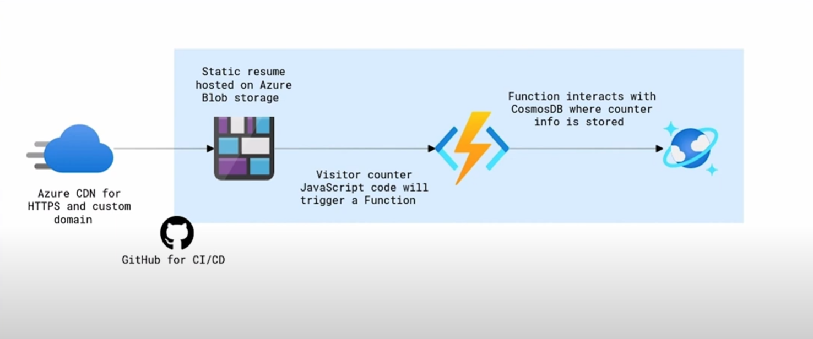

# Azure Resume Challenge
This is my Cloud Resume Challenge built on Azure.

## Introduction 📑
I've been inspired by the Cloud Resume Challenge by A Cloud Guru. I Used Visiual Studio Code with Azure Tools extention pack. .Net 8.0 LTS using a in-process model with the appropriate Nuget packages installed for the resources I am using. The base of the solution lives inside blob storage, which holds the static website of the resume. And in the website I used HTML, CSS and JavaScript. The JavaScript is used to implement a visitor counter. And not only does it display that information, but also to calls to an API, and implements with an Azure function. The Azure function interacts with Azure CosmosDB, which is the database service used to store the visitor counter info. Using Azure CDN to enable features like HTTPS and custom domain support for the static site that is deployed on Azure blob storage. GitHub is used for all our CI/CD tooling. I created an Azure Cosmos DB account database Building the backend container and adding the counter data to that container. The Azure function was built with Visual Code locally with the Azure functions extension. I set up Cosmos DB bindings to retrieve and update the counter data. I deployed the Azure function and retrieved the function URL. Then I updated the JavaScript code with the function URL. Then I deployed the website to blob storage. Then set up Azure CDN and HTTPS support and set up my custom domain. Next, I built the CI/CD pipeline using GitHub. Creating the frontend workflow and that's responsible for deploying any changes made to HTML, CSS, JavaScript. Then I implemented unit tests to test my Azure functions code, and included that in the CI/CD pipeline. Then I created the backend GitHub workflow responsible for deploying anything that's in the backend folder of the project which includes the API and Azure functions. 

## Technologies ⚙
- Azure CosmosDB
- Azure Functions
- Azure Database and Container
- Azure resource group
- Azure Storage

## Languages

- [x] C#
- [x] JavaScript

## Project prerequisites

- [GitHub account](https://github.com/join)
- [Azure account](https://azure.microsoft.com/en-us/free)
- [Azure CLI](https://docs.microsoft.com/en-us/cli/azure/install-azure-cli)
- [.NET Core 8.0 LTS](https://dotnet.microsoft.com/download/dotnet/8.0)
- [Azure Functions Core Tools](https://docs.microsoft.com/en-us/azure/azure-functions/functions-run-local?tabs=macos%2Ccsharp%2Cbash#install-the-azure-functions-core-tools)
- [Visual Studio Code](https://code.visualstudio.com)
- [Visual Code Extensions](https://code.visualstudio.com/docs/introvideos/extend)
- [Azure Functions Extensions](https://marketplace.visualstudio.com/items?itemName=ms-azuretools.vscode-azurefunctions)
- [C# Extension](https://marketplace.visualstudio.com/items?itemName=ms-dotnettools.csharp)
- [Azure Storage Extension](https://marketplace.visualstudio.com/items?itemName=ms-azuretools.vscode-azurestorage)

## Front-end resources

The front-end is a static site with HTML, CSS, and JavaScript. It's static and has a visitor counter. The visitor counter data fetched via an API call to an Azure Function.

- This [article](https://www.digitalocean.com/community/tutorials/how-to-use-the-javascript-fetch-api-to-get-data) explains how to make an API call with JavaScript and in a simple way how to use it to make an API call.
- [Azure storage explorer](https://azure.microsoft.com/en-us/features/storage-explorer/) is a handy tool to use when working with Storage Accounts
- This is how you can [deploy static site to blob storage.](https://docs.microsoft.com/en-us/azure/storage/blobs/storage-blob-static-website-host)
  
## Back-end resources

The back-end is an [HTTP triggered](https://docs.microsoft.com/en-us/azure/azure-functions/functions-bindings-http-webhook-trigger?tabs=csharp) Azure Functions with Cosmos DB input and output binding. The Function is triggered, it retrieves the CosmosDB item, add +1 to it, and saves it and returns its value to the caller.

- [Prerequisites for developing functions with visual code locally.](https://docs.microsoft.com/en-us/azure/azure-functions/create-first-function-vs-code-csharp)
- [Create a Cosmos DB account via command line](https://azure.microsoft.com/en-us/resources/templates/101-cosmosdb-free/) or [from the portal](https://docs.microsoft.com/en-us/azure/cosmos-db/create-cosmosdb-resources-portal).
- [Create an HTTP triggered Azure Function in Visual Studio Code.](https://docs.microsoft.com/en-us/azure/azure-functions/functions-develop-vs-code?tabs=csharp)
- [Azure Functions Cosmos DB bindings](https://docs.microsoft.com/en-us/azure/azure-functions/functions-bindings-cosmosdb-v2)
- [Retrieve a Cosmos DB item with Functions binding.](https://docs.microsoft.com/en-us/azure/azure-functions/functions-bindings-cosmosdb-v2-input?tabs=csharp)
- [Write to a Cosmos DB item with Functions binding.](https://docs.microsoft.com/en-us/azure/azure-functions/functions-bindings-cosmosdb-v2-output?tabs=csharp)
- You'll have to [enable CORS with Azure Functions](https://github.com/Azure/azure-functions-host/issues/1012) locally and once it's [deployed to Azure](https://docs.microsoft.com/en-us/azure/azure-functions/functions-how-to-use-azure-function-app-settings?tabs=portal#cors) for you website to be able to call it.

## Testing Resources

- [Testing is important.](https://dev.to/flippedcoding/its-important-to-test-your-code-3lid)
- [Getting Started with xUnit.net.](https://xunit.net/docs/getting-started/netcore/cmdline)
- [How to setup Xunit with Azure Functions.](https://madebygps.com/how-to-use-xunit-with-azure-functions/)
- [Testing Azure Functions.](https://docs.microsoft.com/en-us/azure/azure-functions/functions-test-a-function)
  
## CI/CD Resources

- This is how you can deploy a blob storage static site with [GitHub actions.](https://docs.microsoft.com/en-us/azure/storage/blobs/storage-blobs-static-site-github-actions) Used in frontend.main.yml.
- This is how you can deploy an [Azure Function to Azure with GitHub Actions.](https://github.com/madebygps/cgc-azure-resume/blob/main) Used in backend.main.yml
- [Implement .NET testing in GitHub Actions.](https://docs.github.com/en/actions/guides/building-and-testing-net)
